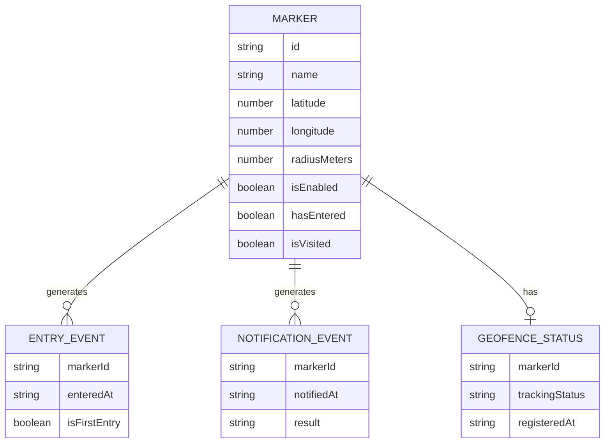
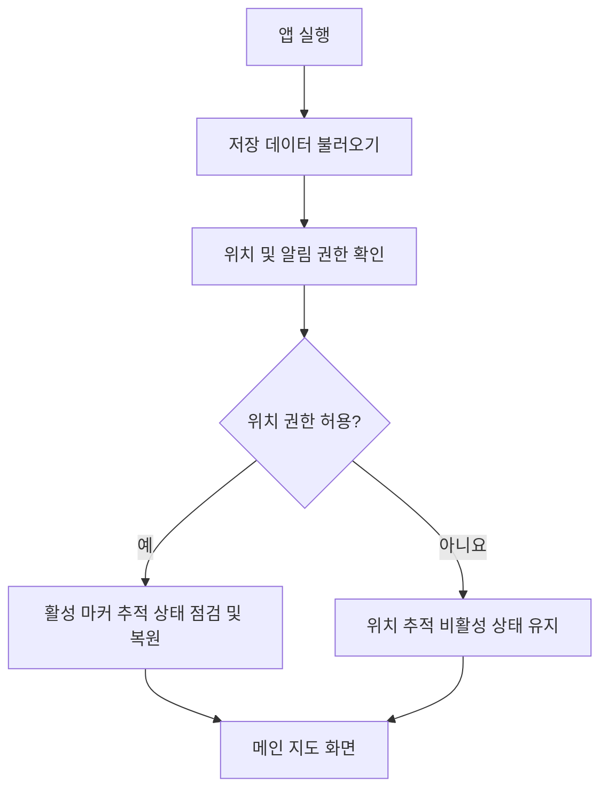
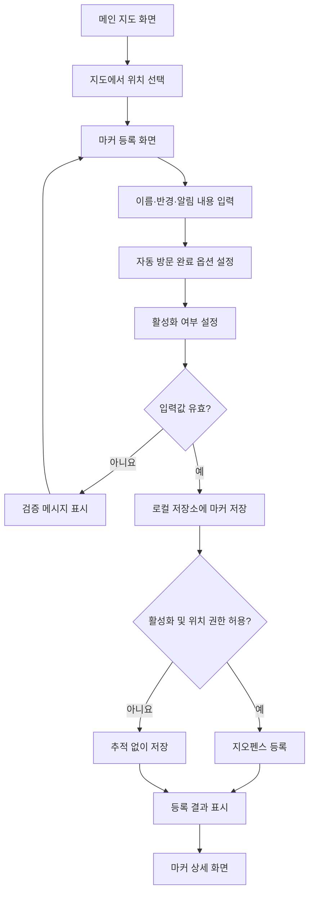
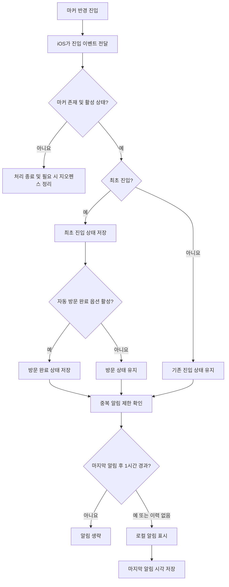
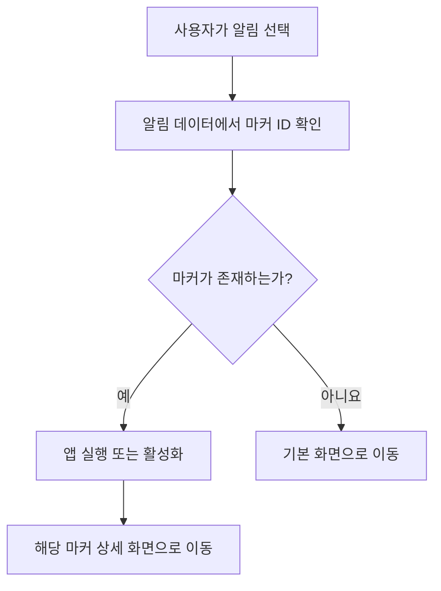
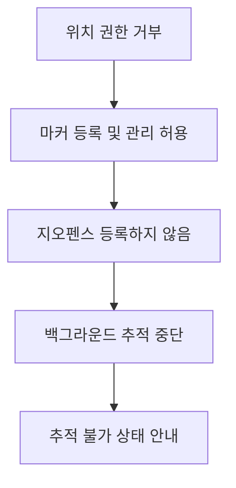

# 위치 기반 마커 알림 앱 통합 설계서

## 1. 문서 정보

| 항목 | 내용 |
|---|---|
| 문서명 | 위치 기반 마커 알림 앱 통합 설계서 |
| 문서 상태 | 초안 |
| 우선 지원 플랫폼 | iOS |
| 후속 지원 플랫폼 | Android |
| 애플리케이션 기술 | React Native |
| 데이터 저장 방식 | 기기 내부 로컬 저장소 |
| 서버 및 외부 DB | 사용하지 않음 |

### 1.1 문서 목적

본 문서는 위치 기반 마커 알림 앱의 현재까지 확정된 요구사항과 설계 방향을 정리한다.

다음 산출물의 초기 내용을 하나의 문서로 통합하며, 설계가 구체화되면 산출물별 문서로 분리할 수 있다.

1. 요구사항 정의서
2. 도메인 정의서
3. 기능 정의서
4. 사용자 흐름도
5. 화면 설계서
6. 프로그램 설계서
7. 로컬 데이터 저장 명세서

---

## 2. 서비스 개요

### 2.1 앱의 목적

사용자가 지도에서 원하는 위치를 선택하여 마커를 등록하고, 사용자가 해당 마커에 설정된 반경 안으로 진입하면 로컬 알림을 제공한다.

마커 등록·조회·수정·삭제는 앱이 포그라운드인 상태에서 수행한다. 마커 반경 진입 감지는 앱이 백그라운드인 상태에서도 동작하도록 구성한다.

### 2.2 주요 용어

| 용어 | 정의 |
|---|---|
| 마커 | 사용자가 지도에 등록한 위치 기반 알림 지점 |
| 알림 반경 | 마커를 중심으로 진입 여부를 판단하는 거리 |
| 지오펜스 | 특정 위도·경도 주변에 가상의 경계를 등록하고, 사용자의 진입 또는 이탈을 운영체제가 감지하는 기능 |
| 진입 이벤트 | 사용자가 마커의 알림 반경 밖에서 안으로 이동했을 때 발생하는 이벤트 |
| 로컬 알림 | 외부 서버 없이 기기 내부에서 생성하여 사용자에게 표시하는 알림 |
| 활성화 | 특정 마커를 위치 추적 대상으로 사용하겠다는 사용자 설정 |
| 추적 상태 | 마커가 운영체제의 위치 감지 기능에 실제로 등록된 상태 |
| 최초 진입 | 사용자가 특정 마커의 반경에 처음으로 진입한 상태 |
| 방문 완료 | 사용자가 해당 마커를 방문한 것으로 표시된 상태 |
| 알림 제한 시간 | 동일 마커의 반복 알림을 방지하는 시간 |

### 2.3 기술적 표현

본 앱은 서버에서 메시지를 전송하지 않으므로 알림 기능을 기술적으로 `푸시 알림`이 아닌 `로컬 알림`로 정의한다.

백그라운드에서 GPS를 지속적으로 실행하는 방식 대신, 운영체제의 지오펜스 기능을 우선 사용한다. 앱은 마커의 위도, 경도 및 반경을 운영체제에 등록하고, 운영체제가 진입 이벤트를 앱에 전달하면 알림과 방문 완료 처리를 수행한다.

위치 이벤트의 발생 시점과 정확도는 GPS 상태, 네트워크 환경, 절전 상태 및 운영체제 정책의 영향을 받을 수 있다.

---

## 3. 범위

### 3.1 포함 범위

- 지도에서 위치를 직접 선택하여 마커 등록
- 마커별 알림 반경 설정
- 마커 조회, 상세 조회, 수정 및 삭제
- 마커별 활성화 및 비활성화
- 활성화된 마커의 백그라운드 진입 감지
- 진입 시 로컬 알림 표시
- 알림 선택 시 해당 마커 상세 화면으로 이동
- 동일 마커의 중복 알림 제한
- 최초 진입 시 선택적으로 방문 완료 자동 처리
- 위치 권한이 없는 상태에서 마커 데이터 관리
- 기기 내부에 마커 및 상태 데이터 저장

### 3.2 현재 제외 범위

- 회원가입 및 로그인
- 서버 기반 데이터 동기화
- 외부 데이터베이스
- 여러 기기 간 데이터 공유
- 원격 푸시 알림
- Android 초기 버전 지원
- 데이터 백업 및 복원
- 마커 공유

---

## 4. 요구사항 정의서

### 4.1 기능 요구사항

| ID | 요구사항 | 우선순위 | 상태 |
|---|---|---|---|
| REQ-001 | 사용자는 지도에서 원하는 위치를 직접 선택하여 마커를 등록할 수 있어야 한다. | 필수 | 확정 |
| REQ-002 | 사용자는 마커 등록 시 이름, 설명, 알림 반경 및 알림 내용을 입력할 수 있어야 한다. | 필수 | 확정 |
| REQ-003 | 사용자는 마커마다 서로 다른 알림 반경을 지정할 수 있어야 한다. | 필수 | 확정 |
| REQ-004 | 마커 등록, 조회, 수정 및 삭제는 앱이 포그라운드인 상태에서 수행해야 한다. | 필수 | 확정 |
| REQ-005 | 사용자는 마커별 위치 추적을 활성화하거나 비활성화할 수 있어야 한다. | 필수 | 확정 |
| REQ-006 | 마커를 비활성화하면 마커 데이터는 유지하고 해당 마커의 위치 감지만 중단해야 한다. | 필수 | 확정 |
| REQ-007 | 마커 삭제 시 로컬 데이터와 운영체제에 등록된 위치 감지 정보를 함께 제거해야 한다. | 필수 | 확정 |
| REQ-008 | 앱은 활성화된 마커에 대한 진입 여부를 백그라운드에서도 감지해야 한다. | 필수 | 확정 |
| REQ-009 | 사용자가 활성화된 마커의 반경에 진입하면 로컬 알림을 표시해야 한다. | 필수 | 확정 |
| REQ-010 | 동일 마커의 알림은 마지막 알림 후 1시간 동안 다시 표시하지 않아야 한다. | 필수 | 확정 |
| REQ-011 | 중복 알림 제한 시간은 앱 공통 상수로 관리해야 한다. | 필수 | 확정 |
| REQ-012 | 사용자가 알림을 선택하면 해당 마커의 상세 화면으로 이동해야 한다. | 필수 | 확정 |
| REQ-013 | 위치 권한이 없어도 사용자는 마커를 등록, 조회, 수정 및 삭제할 수 있어야 한다. | 필수 | 확정 |
| REQ-014 | 위치 권한이 없으면 백그라운드 위치 감지 로직을 실행하지 않아야 한다. | 필수 | 확정 |
| REQ-015 | 위치 권한이 허용되면 활성화 대상으로 설정된 마커의 위치 감지를 등록하거나 복구해야 한다. | 필수 | 확정 |
| REQ-016 | 마커 등록·수정 시 최초 진입 후 방문 완료 플래그를 자동 활성화할지 선택할 수 있어야 한다. | 필수 | 확정 |
| REQ-017 | 자동 방문 완료 옵션이 활성화된 마커에 최초 진입하면 방문 완료 상태로 변경해야 한다. | 필수 | 확정 |
| REQ-018 | 최초 진입 여부와 방문 완료 여부는 별개의 상태로 관리해야 한다. | 필수 | 확정 |
| REQ-019 | 마커 및 알림 처리 데이터는 기기 내부 저장소에 보관해야 한다. | 필수 | 확정 |
| REQ-020 | 초기 지원 플랫폼은 iOS로 하고 Android 확장을 고려하여 플랫폼 종속 로직을 분리해야 한다. | 필수 | 확정 |
| REQ-021 | 앱 재실행 후에도 저장된 마커와 사용자 설정을 복원해야 한다. | 필수 | 확정 |

### 4.2 비기능 요구사항

| ID | 구분 | 요구사항 |
|---|---|---|
| NFR-001 | 배터리 | 백그라운드 위치 감지는 GPS 상시 추적보다 운영체제의 지오펜스 기능을 우선 사용해야 한다. |
| NFR-002 | 신뢰성 | 로컬 저장 데이터와 운영체제의 지오펜스 등록 상태가 불일치할 경우 복구할 수 있어야 한다. |
| NFR-003 | 권한 | 위치 권한 거부가 마커 데이터 관리 기능의 사용을 차단해서는 안 된다. |
| NFR-004 | 확장성 | iOS와 Android의 위치 감지 구현을 공통 비즈니스 로직과 분리해야 한다. |
| NFR-005 | 데이터 | 저장 데이터에 스키마 버전을 부여하여 앱 업데이트 시 마이그레이션할 수 있어야 한다. |
| NFR-006 | 사용성 | 마커의 활성화 상태와 실제 추적 가능 상태를 사용자가 구분할 수 있어야 한다. |
| NFR-007 | 제약 고지 | 위치 감지는 운영체제와 기기 환경의 영향을 받으므로 반경 진입 즉시 동작하는 것을 보장하지 않는다. |

### 4.3 권한별 동작

| 위치 권한 상태 | 마커 데이터 관리 | 지오펜스 등록 | 백그라운드 감지 | 사용자 안내 |
|---|---:|---:|---:|---|
| 허용 | 가능 | 가능 | 가능 | 추적 가능 상태 표시 |
| 앱 사용 중에만 허용 | 가능 | 플랫폼 정책에 따라 제한 | 제한 또는 불가 | 백그라운드 권한 필요 안내 |
| 거부 | 가능 | 불가 | 불가 | 마커는 저장되지만 추적되지 않음을 안내 |
| 미결정 | 가능 | 권한 허용 전까지 불가 | 불가 | 필요한 시점에 권한 요청 |

알림 권한이 거부된 경우의 세부 정책은 추후 확정한다.

---

## 5. 도메인 정의서

### 5.1 도메인 관계



### 5.2 Marker

사용자가 지도에 등록하는 위치 기반 알림 지점이다.

| 속성 | 형식 | 필수 | 설명 |
|---|---|---:|---|
| id | string | Y | 마커 고유 식별자 |
| name | string | Y | 마커 이름 |
| description | string | N | 마커 설명 |
| latitude | number | Y | 위도 |
| longitude | number | Y | 경도 |
| radiusMeters | number | Y | 알림 반경(미터) |
| notificationTitle | string | Y | 로컬 알림 제목 |
| notificationMessage | string | Y | 로컬 알림 내용 |
| isEnabled | boolean | Y | 사용자가 위치 추적을 활성화했는지 여부 |
| autoMarkVisitedOnFirstEntry | boolean | Y | 최초 진입 시 방문 완료 자동 처리 여부 |
| hasEntered | boolean | Y | 한 번이라도 반경에 진입했는지 여부 |
| firstEnteredAt | ISO 8601 string | N | 최초 진입 시각 |
| isVisited | boolean | Y | 방문 완료 여부 |
| visitedAt | ISO 8601 string | N | 방문 완료 시각 |
| lastNotifiedAt | ISO 8601 string | N | 마지막 알림 표시 시각 |
| createdAt | ISO 8601 string | Y | 생성 시각 |
| updatedAt | ISO 8601 string | Y | 수정 시각 |

### 5.3 GeofenceStatus

운영체제에 마커의 위치 감지가 실제로 등록되어 있는지를 나타낸다.

| 속성 | 형식 | 필수 | 설명 |
|---|---|---:|---|
| markerId | string | Y | 연결된 마커 ID |
| trackingStatus | enum | Y | 위치 추적 상태 |
| registeredAt | ISO 8601 string | N | 운영체제 등록 시각 |
| lastErrorCode | string | N | 마지막 등록 실패 코드 |

`trackingStatus` 후보 값:

| 값 | 의미 |
|---|---|
| notRegistered | 등록되지 않음 |
| registered | 운영체제에 정상 등록됨 |
| disabled | 사용자가 마커를 비활성화함 |
| permissionDenied | 위치 권한이 없어 등록할 수 없음 |
| registrationFailed | 운영체제 등록 실패 |

### 5.4 EntryEvent

마커 반경 진입 사실을 나타낸다. 초기 버전에서 전체 이력을 저장할지는 추후 결정하되, 최초 진입 상태는 반드시 마커에 반영한다.

### 5.5 NotificationEvent

진입 이벤트에 따라 알림을 표시했거나 중복 제한으로 생략한 결과를 나타낸다. 초기 버전에서 전체 이력을 저장할지는 추후 결정한다.

### 5.6 주요 업무 규칙

| ID | 규칙 |
|---|---|
| BR-001 | 마커의 `isEnabled`와 실제 `trackingStatus`는 별도로 관리한다. |
| BR-002 | 위치 권한이 없더라도 `isEnabled` 사용자 설정은 유지할 수 있다. |
| BR-003 | 위치 권한이 복구되면 `isEnabled = true`인 마커의 지오펜스 등록을 시도한다. |
| BR-004 | 최초 진입 시 `hasEntered = true`와 `firstEnteredAt`을 기록한다. |
| BR-005 | `autoMarkVisitedOnFirstEntry = true`인 마커의 최초 진입 시 `isVisited = true`와 `visitedAt`을 기록한다. |
| BR-006 | 방문 완료 처리는 알림 표시 여부와 독립적으로 수행한다. |
| BR-007 | 마지막 알림 후 1시간 이내의 동일 마커 진입 알림은 표시하지 않는다. |
| BR-008 | 마커 비활성화 시 데이터는 유지하고 지오펜스만 해제한다. |
| BR-009 | 마커 삭제 시 마커 데이터와 해당 지오펜스를 함께 제거한다. |

---

## 6. 기능 정의서

### 6.1 기능 목록

| ID | 기능명 | 설명 | 관련 요구사항 |
|---|---|---|---|
| FNC-001 | 마커 등록 | 지도에서 선택한 위치에 마커와 알림 조건을 등록한다. | REQ-001, REQ-002, REQ-003, REQ-016 |
| FNC-002 | 마커 목록 조회 | 저장된 마커와 주요 상태를 목록으로 조회한다. | REQ-004 |
| FNC-003 | 마커 상세 조회 | 선택한 마커의 위치, 알림 및 방문 정보를 조회한다. | REQ-004, REQ-012 |
| FNC-004 | 마커 수정 | 등록된 마커의 정보와 알림 조건을 수정한다. | REQ-004 |
| FNC-005 | 마커 삭제 | 마커 및 연결된 위치 감지 정보를 제거한다. | REQ-007 |
| FNC-006 | 마커 활성화 | 마커를 위치 추적 대상으로 설정하고 지오펜스 등록을 시도한다. | REQ-005, REQ-015 |
| FNC-007 | 마커 비활성화 | 마커 데이터는 유지하면서 지오펜스를 해제한다. | REQ-005, REQ-006 |
| FNC-008 | 위치 권한 관리 | 권한 상태를 확인하고 필요한 경우 사용자에게 권한을 요청한다. | REQ-013, REQ-014, REQ-015 |
| FNC-009 | 백그라운드 진입 감지 | 운영체제로부터 마커 반경 진입 이벤트를 수신한다. | REQ-008 |
| FNC-010 | 로컬 알림 표시 | 중복 제한 조건을 확인한 뒤 진입 알림을 표시한다. | REQ-009, REQ-010, REQ-011 |
| FNC-011 | 알림 딥링크 처리 | 선택한 알림의 마커 ID를 이용하여 상세 화면을 연다. | REQ-012 |
| FNC-012 | 최초 진입 처리 | 최초 진입 상태를 저장하고 필요하면 방문 완료 처리한다. | REQ-016, REQ-017, REQ-018 |
| FNC-013 | 추적 상태 복원 | 앱 시작 또는 권한 변경 시 활성화된 마커의 추적 상태를 점검하고 복원한다. | REQ-015, REQ-021 |

### 6.2 마커 등록

**입력**

- 지도에서 선택한 위도와 경도
- 마커 이름
- 마커 설명(선택)
- 알림 반경
- 알림 제목
- 알림 내용
- 활성화 여부
- 최초 진입 시 방문 완료 자동 처리 여부

**처리**

1. 입력값을 검증한다.
2. 마커 ID와 생성 시각을 생성한다.
3. 마커를 로컬 저장소에 저장한다.
4. 활성화된 마커이며 위치 권한이 충분하면 지오펜스를 등록한다.
5. 위치 권한이 없으면 마커만 저장하고 추적 상태를 `permissionDenied`로 기록한다.

**출력**

- 등록 성공 후 마커 상세 화면 또는 이전 화면으로 이동
- 추적 등록 결과 표시

### 6.3 진입 이벤트 처리

**입력**

- 운영체제가 전달한 마커 식별자
- 이벤트 발생 시각

**처리**

1. 마커 식별자로 저장된 마커를 조회한다.
2. 마커가 존재하고 활성화 상태인지 확인한다.
3. 최초 진입이면 `hasEntered`와 `firstEnteredAt`을 갱신한다.
4. 최초 진입이며 자동 완료 옵션이 활성화되어 있으면 방문 완료 상태를 갱신한다.
5. 마지막 알림 시각과 현재 시각의 차이를 확인한다.
6. 1시간 이상 경과했거나 알림 이력이 없으면 로컬 알림을 표시한다.
7. 알림을 표시한 경우 `lastNotifiedAt`을 갱신한다.

**예외**

- 마커가 삭제되었으면 남아 있는 지오펜스를 해제하고 종료한다.
- 마커가 비활성화되어 있으면 지오펜스를 해제하고 알림을 표시하지 않는다.
- 알림 권한이 없으면 방문 상태만 갱신하고 알림은 표시하지 않는다.

### 6.4 마커 삭제

1. 삭제 대상 마커를 확인한다.
2. 사용자에게 삭제 확인을 요청한다.
3. 운영체제에 등록된 지오펜스를 해제한다.
4. 로컬 저장소에서 마커를 삭제한다.
5. 관련 임시 상태가 있으면 정리한다.

---

## 7. 사용자 흐름도

### 7.1 최초 실행 및 권한 처리



### 7.2 마커 등록



### 7.3 백그라운드 진입 및 알림



### 7.4 알림 선택



### 7.5 위치 권한 거부 상태



---

## 8. 화면 설계서

### 8.1 화면 목록

| ID | 화면명 | 목적 | 주요 진입 경로 |
|---|---|---|---|
| SCR-001 | 메인 지도 | 현재 위치와 등록된 마커를 지도에서 조회한다. | 앱 실행 |
| SCR-002 | 마커 등록 | 선택한 위치에 새 마커를 등록한다. | 메인 지도 |
| SCR-003 | 마커 목록 | 전체 마커와 활성화·방문·추적 상태를 조회한다. | 메인 메뉴 또는 탭 |
| SCR-004 | 마커 상세 | 마커의 전체 정보와 상태를 조회한다. | 지도, 목록, 알림 |
| SCR-005 | 마커 수정 | 마커 위치 및 설정을 수정한다. | 마커 상세 |
| SCR-006 | 권한 안내 | 위치 또는 알림 권한이 필요한 이유와 현재 상태를 안내한다. | 권한 필요 시 |

### 8.2 SCR-001 메인 지도

**주요 구성 요소**

- 지도
- 현재 위치 표시
- 등록된 마커 표시
- 위치 선택 기능
- 마커 등록 버튼
- 마커 목록 이동 버튼
- 위치 추적 가능 여부 표시

**주요 이벤트**

| 이벤트 | 처리 |
|---|---|
| 지도 위치 선택 | 선택 위치를 임시 마커로 표시 |
| 등록 버튼 선택 | 선택 좌표와 함께 마커 등록 화면으로 이동 |
| 기존 마커 선택 | 해당 마커 요약 표시 또는 상세 화면 이동 |
| 권한 상태 선택 | 권한 안내 화면 이동 |

### 8.3 SCR-002 마커 등록

**입력 항목**

| 항목 | 필수 | 비고 |
|---|---:|---|
| 위치 | Y | 지도에서 선택한 좌표 |
| 이름 | Y | 길이 제한 추후 확정 |
| 설명 | N | 길이 제한 추후 확정 |
| 알림 반경 | Y | 허용 범위 추후 확정 |
| 알림 제목 | Y | 기본값 제공 여부 추후 확정 |
| 알림 내용 | Y | 기본값 제공 여부 추후 확정 |
| 마커 활성화 | Y | 기본값 추후 확정 |
| 최초 진입 시 방문 완료 | Y | 기본값 추후 확정 |

**상태 안내**

- 위치 권한이 없더라도 저장 가능
- 권한이 없으면 백그라운드 추적과 알림이 동작하지 않음을 표시

### 8.4 SCR-003 마커 목록

**표시 항목**

- 마커 이름
- 활성화 여부
- 실제 추적 상태
- 알림 반경
- 방문 완료 여부
- 마지막 알림 시각

**주요 이벤트**

- 마커 상세 이동
- 활성화 또는 비활성화
- 필터 및 정렬은 추후 범위로 결정

### 8.5 SCR-004 마커 상세

**표시 항목**

- 지도와 마커 위치
- 이름 및 설명
- 알림 반경
- 알림 제목 및 내용
- 활성화 여부
- 실제 추적 상태
- 최초 진입 여부 및 시각
- 방문 완료 여부 및 시각
- 마지막 알림 시각

**주요 이벤트**

- 수정
- 활성화 또는 비활성화
- 삭제

### 8.6 SCR-005 마커 수정

등록 화면과 같은 항목을 제공한다. 위치, 반경 또는 활성화 상태가 변경되면 기존 지오펜스를 해제한 뒤 변경된 정보로 다시 등록한다.

### 8.7 SCR-006 권한 안내

**표시 항목**

- 위치 권한 상태
- 알림 권한 상태
- 권한이 필요한 이유
- 권한이 없을 때 제한되는 기능
- 시스템 설정 이동 버튼

---

## 9. 프로그램 설계서

### 9.1 설계 원칙

- UI, 비즈니스 규칙, 로컬 저장소 및 플랫폼 기능을 분리한다.
- iOS 우선으로 구현하되 Android 구현을 교체 가능한 어댑터 형태로 구성한다.
- 마커의 사용자 활성화 설정과 운영체제의 실제 추적 상태를 분리한다.
- 위치 이벤트 처리와 알림 표시를 분리하여 알림 권한이 없어도 방문 상태가 갱신되도록 한다.
- 저장 데이터는 스키마 버전을 기반으로 마이그레이션할 수 있도록 한다.

### 9.2 논리 구조

```text
Presentation
├─ Screens
├─ Components
└─ Navigation

Application
├─ Marker use cases
├─ Geofence event handler
├─ Notification coordinator
└─ Permission coordinator

Domain
├─ Marker
├─ Tracking status
├─ Entry rules
└─ Notification cooldown rules

Infrastructure
├─ Local storage
├─ iOS geofence adapter
├─ Notification adapter
└─ Permission adapter
```

### 9.3 권장 폴더 구조

```text
src/
├─ app/
│  ├─ navigation/
│  └─ providers/
├─ features/
│  ├─ markers/
│  │  ├─ screens/
│  │  ├─ components/
│  │  ├─ application/
│  │  └─ domain/
│  ├─ geofencing/
│  │  ├─ application/
│  │  └─ infrastructure/
│  ├─ notifications/
│  └─ permissions/
├─ infrastructure/
│  └─ storage/
├─ shared/
│  ├─ constants/
│  ├─ types/
│  └─ utils/
└─ index.ts
```

### 9.4 주요 모듈

| ID | 모듈 | 책임 |
|---|---|---|
| MOD-001 | MarkerRepository | 마커 데이터 조회 및 저장 |
| MOD-002 | MarkerService | 마커 등록, 수정, 삭제 및 상태 변경 |
| MOD-003 | GeofenceService | 지오펜스 등록, 해제 및 복원 |
| MOD-004 | GeofenceEventHandler | 백그라운드 진입 이벤트 처리 |
| MOD-005 | NotificationService | 로컬 알림 표시 및 선택 이벤트 처리 |
| MOD-006 | PermissionService | 위치 및 알림 권한 상태 확인과 요청 |
| MOD-007 | NavigationService | 알림에서 마커 상세 화면으로 이동 |
| MOD-008 | StorageMigrationService | 로컬 저장 데이터 버전 마이그레이션 |

### 9.5 주요 상수

```ts
export const MARKER_NOTIFICATION_COOLDOWN_MS = 60 * 60 * 1000;
```

중복 알림 제한 시간은 초기값을 1시간으로 하며, 도메인 로직에 숫자를 직접 작성하지 않고 공통 상수로 관리한다.

### 9.6 진입 이벤트 의사 코드

```ts
async function handleMarkerEntry(markerId: string, enteredAt: Date) {
  const marker = await markerRepository.findById(markerId);

  if (!marker || !marker.isEnabled) {
    await geofenceService.unregister(markerId);
    return;
  }

  const isFirstEntry = !marker.hasEntered;

  if (isFirstEntry) {
    marker.hasEntered = true;
    marker.firstEnteredAt = enteredAt.toISOString();

    if (marker.autoMarkVisitedOnFirstEntry) {
      marker.isVisited = true;
      marker.visitedAt = enteredAt.toISOString();
    }
  }

  const canNotify =
    !marker.lastNotifiedAt ||
    enteredAt.getTime() - new Date(marker.lastNotifiedAt).getTime() >=
      MARKER_NOTIFICATION_COOLDOWN_MS;

  if (canNotify) {
    const notificationShown =
      await notificationService.showMarkerEntryNotification(marker);

    if (notificationShown) {
      marker.lastNotifiedAt = enteredAt.toISOString();
    }
  }

  marker.updatedAt = enteredAt.toISOString();
  await markerRepository.save(marker);
}
```

### 9.7 상태 복구

앱 시작, 포그라운드 복귀 또는 권한 변경 확인 시 다음 절차를 수행한다.

1. 저장된 마커 목록을 불러온다.
2. 현재 위치 권한을 확인한다.
3. 권한이 없으면 등록된 지오펜스를 정리하고 추적 상태를 갱신한다.
4. 권한이 있으면 활성 마커와 실제 등록 상태를 비교한다.
5. 누락된 활성 마커는 등록한다.
6. 비활성화되었거나 삭제된 마커의 지오펜스는 해제한다.

---

## 10. 로컬 데이터 저장 명세서

### 10.1 저장 방식

React Native에는 웹 브라우저의 `localStorage`가 기본 제공되지 않으므로 비동기 로컬 저장소를 사용한다. 구체적인 라이브러리는 기술 검토 후 결정한다.

현재 데이터에는 인증 정보나 비밀번호를 포함하지 않는다. 추후 민감정보가 추가되면 일반 로컬 저장소와 분리하여 보안 저장소 사용을 검토한다.

### 10.2 저장 키

| ID | 저장 키 | 형식 | 설명 |
|---|---|---|---|
| STG-001 | `app:schemaVersion` | number | 로컬 데이터 스키마 버전 |
| STG-002 | `markers` | Marker[] | 전체 마커 데이터 |
| STG-003 | `geofenceStatuses` | GeofenceStatus[] | 마커별 실제 추적 상태 |

저장 키의 접두사와 최종 명칭은 앱 이름 확정 후 조정할 수 있다.

### 10.3 Marker JSON 예시

```json
{
  "id": "marker_01",
  "name": "회사 근처",
  "description": "회사에 도착하면 알림",
  "latitude": 37.000001,
  "longitude": 127.000001,
  "radiusMeters": 100,
  "notificationTitle": "목적지에 도착했습니다",
  "notificationMessage": "회사 근처에 진입했습니다.",
  "isEnabled": true,
  "autoMarkVisitedOnFirstEntry": true,
  "hasEntered": false,
  "firstEnteredAt": null,
  "isVisited": false,
  "visitedAt": null,
  "lastNotifiedAt": null,
  "createdAt": "2026-07-29T07:00:00.000Z",
  "updatedAt": "2026-07-29T07:00:00.000Z"
}
```

### 10.4 기본값

| 필드 | 기본값 |
|---|---|
| description | 빈 문자열 또는 미지정 |
| isEnabled | 추후 확정 |
| autoMarkVisitedOnFirstEntry | 추후 확정 |
| hasEntered | false |
| firstEnteredAt | null |
| isVisited | false |
| visitedAt | null |
| lastNotifiedAt | null |

### 10.5 데이터 정합성 규칙

- `hasEntered = false`이면 `firstEnteredAt`은 `null`이어야 한다.
- `isVisited = false`이면 `visitedAt`은 `null`이어야 한다.
- `isEnabled = false`인 마커는 운영체제에 지오펜스가 등록되지 않아야 한다.
- 삭제된 마커의 `GeofenceStatus` 데이터는 함께 삭제해야 한다.
- 모든 날짜와 시각은 ISO 8601 UTC 문자열로 저장한다.
- 사용자 화면에는 기기의 현지 시간대로 변환하여 표시한다.

### 10.6 초기 스키마 버전

```json
{
  "schemaVersion": 1
}
```

앱 시작 시 현재 스키마 버전과 저장된 버전을 비교하고, 버전이 다르면 순차적인 데이터 마이그레이션을 수행한다.

---

## 11. 추적성 매트릭스

| 요구사항 | 기능 | 화면 | 저장 데이터 |
|---|---|---|---|
| REQ-001~003 | FNC-001 | SCR-001, SCR-002 | STG-002 |
| REQ-004 | FNC-002~005 | SCR-003~005 | STG-002 |
| REQ-005~007 | FNC-005~007 | SCR-003, SCR-004 | STG-002, STG-003 |
| REQ-008~011 | FNC-009, FNC-010 | 해당 없음 | STG-002, STG-003 |
| REQ-012 | FNC-011 | SCR-004 | STG-002 |
| REQ-013~015 | FNC-008, FNC-013 | SCR-006 | STG-002, STG-003 |
| REQ-016~018 | FNC-001, FNC-012 | SCR-002, SCR-004, SCR-005 | STG-002 |
| REQ-019~021 | FNC-013 | 전체 | STG-001~003 |

---

## 12. 미결정 사항

다음 항목은 후속 협의가 필요하다.

| ID | 항목 | 검토 내용 |
|---|---|---|
| TBD-001 | 앱 이름 | 문서명, 저장 키 접두사 및 화면 타이틀에 사용 |
| TBD-002 | 지도 제공자 | Apple Maps, Google Maps 등 |
| TBD-003 | React Native 구성 | React Native CLI 또는 Expo 기반 구성 |
| TBD-004 | 로컬 저장 라이브러리 | 비동기 저장소 구체화 |
| TBD-005 | 위치·지오펜스 라이브러리 | iOS 백그라운드 동작과 라이선스 검토 |
| TBD-006 | 로컬 알림 라이브러리 | 백그라운드 이벤트 및 딥링크 지원 검토 |
| TBD-007 | 알림 권한 거부 정책 | 방문 상태만 기록할지 및 안내 방식 |
| TBD-008 | 마커 활성화 기본값 | 등록 즉시 활성화 여부 |
| TBD-009 | 자동 방문 완료 기본값 | 등록 화면의 옵션 기본값 |
| TBD-010 | 방문 완료 수동 변경 | 사용자가 완료 처리 또는 완료 취소할 수 있는지 |
| TBD-011 | 마커 반경 범위 | 최소값, 최대값 및 입력 단위 |
| TBD-012 | 마커 개수 정책 | 운영체제의 위치 감지 등록 한도를 고려한 활성 마커 정책 |
| TBD-013 | 현재 반경 내부 등록 | 등록 시 이미 반경 안에 있는 경우 최초 진입 처리 방식 |
| TBD-014 | 진입 후 재알림 | 반경 이탈 후 재진입과 1시간 제한의 세부 규칙 |
| TBD-015 | 알림 기본 문구 | 사용자 직접 입력 및 기본값 정책 |
| TBD-016 | 마커 위치 수정 | 지도에서 재선택하는 상세 UX |
| TBD-017 | 데이터 초기화 | 전체 마커 삭제 및 앱 초기화 기능 |
| TBD-018 | 백업·복원 | 파일 내보내기 및 가져오기 지원 여부 |
| TBD-019 | 알림·진입 이력 | 전체 이벤트 이력 저장 및 화면 제공 여부 |
| TBD-020 | 테스트 기준 | 실제 기기, 백그라운드, 재부팅 및 권한 변경 시나리오 |

---

## 13. 제약 및 주의사항

- 앱 삭제 또는 기기 교체 시 로컬 데이터가 유실될 수 있다.
- 백그라운드 위치 감지는 iOS 권한과 시스템 정책의 영향을 받는다.
- 지오펜스 진입 이벤트는 정확한 반경 경계 통과 시점과 차이가 발생할 수 있다.
- 운영체제가 동시에 감시할 수 있는 위치 영역 수에는 제한이 있으므로 활성 마커 정책이 필요하다.
- 사용자가 위치 서비스 또는 알림 권한을 끄면 관련 기능이 제한된다.
- iOS 시뮬레이터만으로 백그라운드 위치 동작을 완전히 검증할 수 없으므로 실제 기기 테스트가 필요하다.

---

## 14. 후속 작성 순서

1. 미결정 사항 중 제품 정책 확정
2. 요구사항의 상세 수용 기준 작성
3. 화면별 와이어프레임과 입력 검증 규칙 작성
4. iOS 기술 스택 및 라이브러리 선정
5. 운영체제 지오펜스 제한에 따른 활성 마커 정책 확정
6. 테스트 시나리오와 완료 기준 작성
7. 통합 문서를 산출물별 문서로 분리

