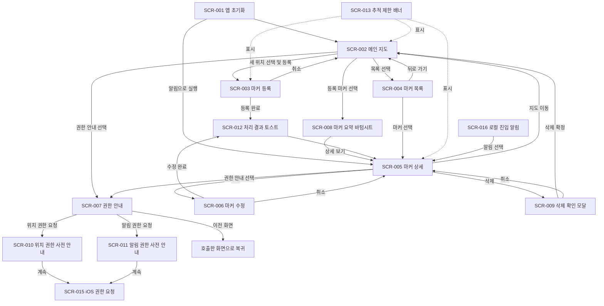

# 위치 기반 마커 알림 앱 화면 설계서 개요

## 1. 문서 개요

### 1.1 문서 정보

| 항목 | 내용 |
|---|---|
| 문서명 | 위치 기반 마커 알림 앱 화면 설계서 개요 |
| 문서 버전 | 0.2 |
| 문서 상태 | 초안 |
| 우선 지원 플랫폼 | iOS |
| 애플리케이션 기술 | React Native |
| 작성일 | 2026-08-04 |

### 1.2 문서 목적

본 문서는 위치 기반 마커 알림 앱에서 사용자에게 표시되는 모든 UI 단위의 종류와 역할을 정의한다.

본 문서에서 `화면`은 전체 페이지뿐 아니라 모달, 바텀시트, 토스트, 배너, 오버레이 및 운영체제 팝업을 포함한다. 표시 면적이나 UI 형태가 다르더라도 독립적인 표시 조건, 전달 정보 또는 사용자 동작이 있으면 하나의 화면 설계 대상으로 관리한다.

화면별 UI 배치, 입력 항목, 버튼 동작, 상태, 예외 처리 및 와이어프레임은 추후 작성할 상세 화면 설계서에서 정의한다.

### 1.3 화면 ID 규칙

모든 화면에는 `SCR-숫자 3자리` 형식의 고유 ID를 사용한다.

예: `SCR-001`, `SCR-002`

---

## 2. 화면 구성 원칙

- 초기 버전은 iOS 사용 환경을 우선하여 설계한다.
- 지도 화면을 앱의 중심 화면으로 사용한다.
- 마커 등록, 조회, 수정 및 삭제는 앱이 포그라운드인 상태에서 수행한다.
- 마커 활성화 상태와 실제 위치 추적 가능 상태를 사용자가 구분할 수 있도록 한다.
- 위치 권한이 없어도 마커 등록과 관리 화면은 사용할 수 있도록 한다.
- 로컬 알림을 선택하면 해당 마커의 상세 화면으로 이동한다.
- 삭제 확인, 권한 안내 및 처리 결과도 각각 화면 ID를 부여하여 관리한다.
- 정보의 중요도, 사용자의 결정 필요 여부 및 현재 작업을 방해해야 하는 정도에 따라 전체 화면, 모달, 바텀시트, 토스트 또는 배너를 선택한다.

### 2.1 UI 형태 선정 기준

| UI 형태 | 적용 기준 |
|---|---|
| 전체 화면 | 사용자가 집중해서 조회·입력하거나 독립적인 이동 경로가 필요한 경우 |
| 모달·알림 팝업 | 삭제처럼 사용자의 명시적인 결정을 받아야 하며 기존 작업을 일시 중단해야 하는 경우 |
| 바텀시트 | 현재 화면의 맥락을 유지하면서 추가 정보나 선택지를 제공하는 경우 |
| 토스트 | 저장 성공처럼 별도 응답이 필요 없고 잠시 표시한 뒤 자동으로 사라져도 되는 결과 안내 |
| 배너·인라인 안내 | 권한 부족이나 추적 불가처럼 사용자가 화면을 사용하는 동안 지속적으로 알아야 하는 상태 |
| 로딩 오버레이 | 저장이나 초기화처럼 진행 중에는 중복 조작을 막아야 하는 짧은 처리 상태 |
| 시스템 팝업 | 위치·알림 권한처럼 iOS가 직접 사용자 승인을 받아야 하는 경우 |

---

## 3. 화면 목록

| 화면 ID | 화면명 | 권장 UI 형태 | 역할 |
|---|---|---|---|
| SCR-001 | 앱 초기화 | 전체 화면 또는 스플래시 | 앱 실행 시 로컬 데이터, 권한 및 마커 추적 상태를 확인하고 최초 진입 화면을 결정한다. |
| SCR-002 | 메인 지도 | 전체 화면 | 지도, 현재 위치 및 등록된 마커를 표시하고 새로운 마커 위치를 선택한다. |
| SCR-003 | 마커 등록 | 전체 화면 | 지도에서 선택한 위치에 마커 정보와 알림 조건을 입력하여 등록한다. |
| SCR-004 | 마커 목록 | 전체 화면 | 등록된 전체 마커와 활성화, 추적 및 방문 상태를 목록으로 확인한다. |
| SCR-005 | 마커 상세 | 전체 화면 | 선택한 마커의 전체 정보와 상태를 확인하고 수정, 활성화·비활성화 및 삭제 기능으로 연결한다. |
| SCR-006 | 마커 수정 | 전체 화면 | 등록된 마커의 위치, 정보, 알림 조건 및 자동 방문 완료 옵션을 변경한다. |
| SCR-007 | 권한 관리 안내 | 전체 화면 | 위치 및 알림 권한의 현재 상태와 설정 방법을 종합적으로 안내한다. |
| SCR-008 | 마커 요약 | 바텀시트 | 지도에서 선택한 마커의 핵심 정보를 표시하고 상세 화면 이동을 제공한다. |
| SCR-009 | 마커 삭제 확인 | 모달·알림 팝업 | 삭제 대상과 복구 불가 사실을 알리고 삭제 여부를 확인한다. |
| SCR-010 | 위치 권한 사전 안내 | 바텀시트 또는 모달 | iOS 권한 요청 전에 사용 목적과 권한 거부 시 제한을 설명한다. |
| SCR-011 | 알림 권한 사전 안내 | 바텀시트 또는 모달 | iOS 알림 권한 요청 전에 사용 목적과 권한 거부 시 동작을 설명한다. |
| SCR-012 | 처리 결과 안내 | 토스트 | 마커 등록·수정, 활성화 변경 등 짧은 처리 결과를 일시적으로 알린다. |
| SCR-013 | 추적 제한 안내 | 배너·인라인 안내 | 위치 권한이나 시스템 상태로 인해 마커를 추적할 수 없음을 지속적으로 표시한다. |
| SCR-014 | 로딩 및 처리 중 | 로딩 오버레이 | 초기화 또는 저장 중 중복 조작을 방지하고 처리 중임을 표시한다. |
| SCR-015 | iOS 권한 요청 | 시스템 팝업 | 위치 또는 알림 권한에 대한 사용자의 운영체제 승인을 받는다. |
| SCR-016 | 로컬 진입 알림 | iOS 알림 UI | 마커 반경 진입 사실을 앱 외부에서도 사용자에게 전달한다. |

---

## 4. 화면별 역할

### 4.1 SCR-001 앱 초기화 화면

앱 실행에 필요한 초기 처리를 수행하는 화면이다.

**주요 역할**

- 로컬 저장 데이터 불러오기
- 데이터 스키마 버전 확인
- 위치 및 알림 권한 상태 확인
- 활성화된 마커의 실제 추적 상태 확인 및 복구 요청
- 알림을 통해 실행된 경우 대상 마커 확인
- 초기 처리 결과에 따라 메인 지도 또는 마커 상세 화면으로 이동

이 화면은 사용자 입력을 받기 위한 화면이 아니며, 초기 처리가 끝나면 자동으로 다음 화면으로 이동한다.

**관련 요구사항**

- `FR-DAT-002` 앱 재실행 시 데이터 복원
- `FR-DAT-003` 스키마 버전 관리
- `FR-LOC-004` 추적 상태 복구
- `FR-NOT-003` 알림 선택 및 화면 이동

### 4.2 SCR-002 메인 지도 화면

앱의 중심 화면으로, 사용자가 지도에서 위치와 마커를 확인하는 화면이다.

**주요 역할**

- 지도 표시
- 현재 위치 표시
- 등록된 마커 표시
- 지도 이동, 확대 및 축소
- 새로운 마커를 등록할 위치 선택
- 선택한 기존 마커의 상세 화면으로 이동
- 마커 목록 화면으로 이동
- 위치 추적 가능 여부 안내

위치 권한이 없어도 지도 탐색과 저장된 마커 확인은 가능해야 한다. 현재 위치 표시는 권한 상태에 따라 제한될 수 있다.

**관련 요구사항**

- `FR-MAP-001` 지도 표시
- `FR-MAP-002` 지도에서 위치 선택
- `FR-MRK-002` 마커 목록 조회
- `FR-MRK-003` 마커 상세 조회
- `FR-PER-002` 위치 권한 거부 시 제한 처리

### 4.3 SCR-003 마커 등록 화면

지도에서 선택한 위치에 새로운 마커를 등록하는 화면이다.

**주요 역할**

- 선택한 위치 확인
- 마커 이름 및 설명 입력
- 마커별 알림 반경 설정
- 로컬 알림 제목 및 내용 설정
- 마커 활성화 여부 설정
- 최초 진입 시 방문 완료 자동 처리 여부 설정
- 입력값 검증 및 마커 저장
- 권한이 없을 경우 추적 제한 안내

마커는 위치 권한이 없어도 등록할 수 있다. 권한이 없으면 데이터만 저장하고 위치 추적은 시작하지 않는다.

**관련 요구사항**

- `FR-MRK-001` 마커 등록
- `FR-LOC-001` 지오펜스 등록
- `FR-PER-002` 위치 권한 거부 시 제한 처리
- `FR-DAT-001` 로컬 데이터 저장

### 4.4 SCR-004 마커 목록 화면

기기에 저장된 모든 마커를 한곳에서 조회하는 화면이다.

**주요 역할**

- 전체 마커 목록 표시
- 마커별 활성화 여부 표시
- 마커별 실제 추적 상태 표시
- 알림 반경과 방문 완료 여부 표시
- 선택한 마커의 상세 화면으로 이동
- 등록된 마커가 없을 때 빈 상태 안내

마커의 사용자 활성화 설정과 실제 추적 상태가 다른 경우 두 상태를 구분하여 표시한다.

**관련 요구사항**

- `FR-MRK-002` 마커 목록 조회
- `FR-MRK-003` 마커 상세 조회
- `FR-MRK-006` 마커 활성화·비활성화
- `NFR-USA-001` 활성화 상태와 추적 상태 구분

### 4.5 SCR-005 마커 상세 화면

선택한 마커의 전체 정보와 현재 상태를 확인하고 관리하는 화면이다.

**주요 역할**

- 지도에서 마커 위치 확인
- 마커 이름, 설명 및 알림 반경 확인
- 알림 제목과 내용 확인
- 활성화 여부와 실제 추적 상태 확인
- 최초 진입 여부와 시각 확인
- 방문 완료 여부와 시각 확인
- 마지막 알림 시각 확인
- 마커 활성화 또는 비활성화
- 마커 수정 화면으로 이동
- 마커 삭제

로컬 알림을 선택했을 때 이동하는 대상 화면이다. 알림의 대상 마커가 이미 삭제된 경우에는 이 화면을 열지 않고 메인 지도 화면으로 이동한다.

**관련 요구사항**

- `FR-MRK-003` 마커 상세 조회
- `FR-MRK-005` 마커 삭제
- `FR-MRK-006` 마커 활성화·비활성화
- `FR-NOT-003` 알림 선택 및 화면 이동
- `FR-ENT-001` 최초 진입 기록
- `FR-ENT-002` 방문 완료 자동 처리

### 4.6 SCR-006 마커 수정 화면

기존 마커의 위치 및 알림 설정을 변경하는 화면이다.

**주요 역할**

- 마커 위치 변경
- 마커 이름 및 설명 변경
- 알림 반경 변경
- 알림 제목 및 내용 변경
- 활성화 여부 변경
- 최초 진입 시 방문 완료 자동 처리 옵션 변경
- 변경값 검증 및 저장

위치 또는 알림 반경이 변경된 활성 마커는 기존 위치 감지 정보를 해제한 뒤 새로운 조건으로 다시 등록한다. 위치 권한이 없으면 수정 내용만 저장한다.

**관련 요구사항**

- `FR-MRK-004` 마커 수정
- `FR-MRK-006` 마커 활성화·비활성화
- `FR-LOC-001` 지오펜스 등록
- `FR-LOC-002` 지오펜스 해제

### 4.7 SCR-007 권한 안내 화면

위치 및 알림 권한의 현재 상태와 권한에 따라 사용할 수 없는 기능을 안내하는 화면이다.

**주요 역할**

- 위치 권한 상태 표시
- 알림 권한 상태 표시
- 각 권한이 필요한 이유 안내
- 권한이 없을 때 제한되는 기능 안내
- 권한 요청 또는 iOS 시스템 설정 이동 안내
- 위치 권한 없이도 사용할 수 있는 기능 안내

권한 요청 자체는 iOS 시스템 팝업에서 처리되며, 이 화면은 요청 전 설명과 거부 후 안내 역할을 담당한다.

**관련 요구사항**

- `FR-PER-001` 위치 권한 확인
- `FR-PER-002` 위치 권한 거부 시 제한 처리
- `FR-PER-003` 권한 복구 후 추적 재등록
- `NFR-USA-002` 권한 제한 안내

---

## 5. 부분·시스템 화면별 역할

### 5.1 SCR-008 마커 요약

메인 지도에서 기존 마커를 선택했을 때 지도 맥락을 유지한 채 핵심 정보를 보여준다.

- **권장 형태:** 화면 하단 바텀시트
- **표시 내용:** 마커 이름, 반경, 활성화 상태, 방문 상태
- **주요 동작:** 마커 상세 화면 이동, 바텀시트 닫기
- **선정 이유:** 사용자가 지도를 벗어나지 않고 여러 마커를 연속해서 확인할 수 있다.

### 5.2 SCR-009 마커 삭제 확인

마커를 영구 삭제하기 전에 사용자의 명시적인 확인을 받는다.

- **권장 형태:** iOS 알림 팝업 또는 앱 모달
- **표시 내용:** 삭제 대상 이름, 삭제 시 추적 정보도 제거된다는 안내
- **주요 동작:** 삭제, 취소
- **선정 이유:** 되돌리기 어려운 작업이므로 자동으로 사라지는 토스트가 아니라 사용자의 결정을 강제하는 UI가 필요하다.

### 5.3 SCR-010 위치 권한 사전 안내

iOS 위치 권한 팝업을 표시하기 전에 권한 사용 목적과 제한 사항을 설명한다.

- **권장 형태:** 바텀시트 또는 모달
- **표시 내용:** 백그라운드 위치 감지 목적, 허용 시 제공 기능, 거부 시 제한 기능
- **주요 동작:** 권한 요청 계속, 나중에 하기
- **선정 이유:** 운영체제 팝업만으로는 앱의 구체적인 사용 목적을 충분히 전달하기 어렵다.

### 5.4 SCR-011 알림 권한 사전 안내

iOS 알림 권한 팝업을 표시하기 전에 로컬 알림의 목적을 설명한다.

- **권장 형태:** 바텀시트 또는 모달
- **표시 내용:** 마커 진입 시 알림이 표시된다는 설명, 거부해도 진입·방문 기록은 처리된다는 안내
- **주요 동작:** 권한 요청 계속, 나중에 하기
- **선정 이유:** 사용자가 권한을 허용하기 전에 실제 제공 가치를 이해할 수 있다.

### 5.5 SCR-012 처리 결과 안내

별도 확인이 필요하지 않은 짧은 처리 결과를 사용자에게 알려준다.

- **권장 형태:** 토스트 UI
- **적용 상황:** 마커 등록 완료, 수정 완료, 활성화·비활성화 완료
- **표시 시간:** 상세 화면 설계에서 결정
- **선정 이유:** 작업 흐름을 중단하지 않으면서 처리 결과를 전달할 수 있다.
- **예외:** 저장 실패처럼 사용자의 조치가 필요하면 토스트만 사용하지 않고 오류 메시지 또는 모달을 함께 제공한다.

### 5.6 SCR-013 추적 제한 안내

마커가 활성화되어 있지만 실제 위치 추적이 불가능한 상태를 지속적으로 표시한다.

- **권장 형태:** 화면 상단 배너 또는 관련 항목 주변 인라인 안내
- **적용 화면:** 메인 지도, 마커 등록, 마커 목록, 마커 상세
- **표시 내용:** 추적 불가 원인, 마커 데이터는 유지된다는 안내, 권한 관리 이동 동작
- **선정 이유:** 추적 불가 상태는 잠깐 표시되는 토스트보다 사용자가 화면을 보는 동안 계속 확인할 수 있어야 한다.

### 5.7 SCR-014 로딩 및 처리 중

앱 초기화, 마커 저장 또는 추적 정보 갱신이 진행 중임을 표시한다.

- **권장 형태:** 전체 또는 부분 로딩 오버레이
- **적용 상황:** 앱 초기화, 데이터 마이그레이션, 중복 제출을 막아야 하는 저장 처리
- **주요 동작:** 원칙적으로 사용자 조작 없음
- **선정 이유:** 처리 중 중복 입력을 방지하고 앱이 응답 중임을 명확히 알린다.
- **주의:** 짧은 조회마다 전체 화면을 차단하지 않으며, 필요한 범위에만 적용한다.

### 5.8 SCR-015 iOS 권한 요청

iOS가 위치 또는 알림 권한에 대해 사용자의 승인을 받는 시스템 화면이다.

- **권장 형태:** iOS 시스템 권한 팝업
- **호출 위치:** SCR-010 또는 SCR-011의 계속 동작 이후
- **주요 동작:** 허용, 제한 허용 또는 거부 등 iOS가 제공하는 선택
- **선정 이유:** 운영체제 권한은 앱 자체 UI만으로 부여할 수 없다.
- **주의:** 앱이 문구와 버튼 구성을 자유롭게 변경할 수 없는 외부 시스템 화면이다.

### 5.9 SCR-016 로컬 진입 알림

사용자가 활성 마커의 반경에 진입했을 때 iOS 알림 영역에 표시된다.

- **권장 형태:** iOS 로컬 알림 UI
- **표시 위치:** 잠금 화면, 알림 센터 또는 배너
- **표시 내용:** 마커별 알림 제목과 내용
- **주요 동작:** 알림 선택 시 SCR-005 마커 상세 화면 이동
- **선정 이유:** 앱이 백그라운드 상태여도 진입 사실을 전달할 수 있다.

---

## 6. 화면 이동 구조



---

## 7. 화면과 요구사항 연결

| 화면 ID | 주요 관련 요구사항 |
|---|---|
| SCR-001 | FR-DAT-002, FR-DAT-003, FR-LOC-004, FR-NOT-003 |
| SCR-002 | FR-MAP-001, FR-MAP-002, FR-MRK-002, FR-MRK-003, FR-PER-002 |
| SCR-003 | FR-MRK-001, FR-LOC-001, FR-PER-002, FR-DAT-001 |
| SCR-004 | FR-MRK-002, FR-MRK-003, FR-MRK-006, NFR-USA-001 |
| SCR-005 | FR-MRK-003, FR-MRK-005, FR-MRK-006, FR-NOT-003, FR-ENT-001, FR-ENT-002 |
| SCR-006 | FR-MRK-004, FR-MRK-006, FR-LOC-001, FR-LOC-002 |
| SCR-007 | FR-PER-001, FR-PER-002, FR-PER-003, NFR-USA-002 |
| SCR-008 | FR-MRK-003, FR-MAP-001 |
| SCR-009 | FR-MRK-005 |
| SCR-010 | FR-PER-001, FR-PER-002, NFR-USA-002 |
| SCR-011 | FR-NOT-001, NFR-USA-002 |
| SCR-012 | FR-MRK-001, FR-MRK-004, FR-MRK-006 |
| SCR-013 | FR-PER-002, FR-LOC-001, NFR-USA-001, NFR-USA-002 |
| SCR-014 | FR-DAT-001, FR-DAT-002, FR-DAT-003 |
| SCR-015 | FR-PER-001, FR-PER-003, FR-NOT-001 |
| SCR-016 | FR-NOT-001, FR-NOT-003 |

---

## 8. 상세 화면 설계서 작성 대상

추후 각 화면별 상세 설계서에서 다음 항목을 정의한다.

- 화면 목적과 진입 조건
- 와이어프레임
- UI 구성 요소와 표시 문구
- 입력 항목과 기본값
- 입력값 검증 규칙
- 사용자 이벤트와 처리 결과
- 화면 상태 및 상태별 표시 방식
- 권한별 동작
- 정상·빈 상태·오류 상태
- 화면 이동 및 전달 파라미터
- 관련 요구사항과 수용 기준

상세 화면 설계서 파일은 화면 ID를 기준으로 다음과 같이 관리한다.

```text
3. 화면설계서/
├─ 화면설계서_개요.md
└─ 상세화면설계서/
   ├─ SCR-001_앱초기화.md
   ├─ SCR-002_메인지도.md
   ├─ SCR-003_마커등록.md
   ├─ SCR-004_마커목록.md
   ├─ SCR-005_마커상세.md
   ├─ SCR-006_마커수정.md
   ├─ SCR-007_권한관리안내.md
   ├─ SCR-008_마커요약_바텀시트.md
   ├─ SCR-009_마커삭제확인_모달.md
   ├─ SCR-010_위치권한사전안내.md
   ├─ SCR-011_알림권한사전안내.md
   ├─ SCR-012_처리결과_토스트.md
   ├─ SCR-013_추적제한_배너.md
   ├─ SCR-014_로딩_오버레이.md
   ├─ SCR-015_iOS권한요청.md
   └─ SCR-016_로컬진입알림.md
```

---

## 9. 미결정 사항

| ID | 항목 | 영향 화면 |
|---|---|---|
| TBD-SCR-001 | 메인 내비게이션을 탭, 메뉴 또는 단일 스택 중 어떤 방식으로 구성할지 | SCR-002, SCR-004 |
| TBD-SCR-002 | 마커 등록 후 상세 화면으로 이동할지 메인 지도로 돌아갈지 | SCR-003 |
| TBD-SCR-003 | 마커 위치 선택을 지도 길게 누르기, 탭 또는 별도 선택 모드 중 어떤 방식으로 제공할지 | SCR-002 |
| TBD-SCR-004 | 마커 활성화 및 자동 방문 완료 옵션의 기본값 | SCR-003 |
| TBD-SCR-005 | 마커 이름, 설명, 알림 문구의 최대 입력 길이 | SCR-003, SCR-006 |
| TBD-SCR-006 | 알림 반경의 기본값, 최소값 및 최대값 | SCR-003, SCR-006 |
| TBD-SCR-007 | 방문 완료 상태를 사용자가 직접 변경할 수 있는지 | SCR-005 |
| TBD-SCR-008 | 마커 목록의 정렬, 검색 및 필터 기능 제공 여부 | SCR-004 |
| TBD-SCR-009 | 위치 및 알림 권한을 요청하는 구체적인 시점 | SCR-003, SCR-007 |
| TBD-SCR-010 | 처리 결과 토스트의 표시 시간과 화면 이동 시 유지 여부 | SCR-012 |
| TBD-SCR-011 | 추적 제한 안내를 공통 상단 배너와 화면별 인라인 안내 중 어떻게 적용할지 | SCR-013 |
| TBD-SCR-012 | 저장 실패 등 사용자 조치가 필요한 오류의 모달 및 인라인 표시 기준 | SCR-003, SCR-006, SCR-012 |
