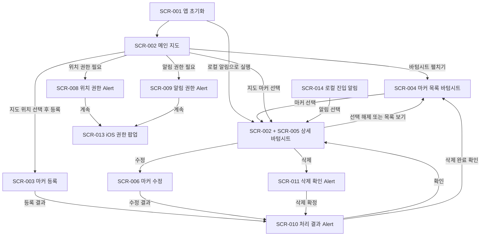

# 위치 기반 마커 알림 앱 화면 설계서 개요

## 1. 문서 개요

### 1.1 문서 정보

| 항목 | 내용 |
|---|---|
| 문서명 | 위치 기반 마커 알림 앱 화면 설계서 개요 |
| 문서 버전 | 0.3 |
| 문서 상태 | 초안 |
| 이전 문서 | `화면설계서_개요.md` |
| 우선 지원 플랫폼 | iOS |
| 애플리케이션 기술 | React Native |
| 작성일 | 2026-08-04 |

### 1.2 문서 목적

본 문서는 위치 기반 마커 알림 앱에서 사용자에게 표시되는 화면과 UI 단위의 종류 및 역할을 정의한다.

본 문서에서 `화면`은 전체 화면뿐 아니라 바텀시트, Alert, 로딩 오버레이, 운영체제 팝업 및 로컬 알림 UI를 포함한다. UI 표시 형태가 다르더라도 독립적인 표시 조건이나 사용자 동작이 있으면 화면 설계 대상으로 관리한다.

화면별 UI 배치, 항목, 이벤트, 상태, 예외 처리 및 와이어프레임은 추후 상세 화면 설계서에서 정의한다.

### 1.3 문서 버전 관리 규칙

설계서 수정 시 기존 파일을 덮어쓰지 않고 다음 형식으로 새 파일을 생성한다.

```text
[파일명][버전].md
```

예시:

```text
화면설계서_개요[0.3].md
요구사항정의서[0.2].md
```

### 1.4 화면 ID 규칙

모든 화면 및 UI 단위에는 `SCR-숫자 3자리` 형식의 고유 ID를 사용한다.

---

## 2. 화면 구성 원칙

- 메인 지도 화면을 앱의 중심 화면으로 사용한다.
- 마커 목록과 선택된 마커 상세 정보는 메인 지도 위의 동일한 바텀시트 영역에서 표시한다.
- 바텀시트에 표시되는 내용은 마커 선택 여부에 따라 변경한다.
- 선택된 마커가 없으면 바텀시트에 마커 목록을 표시한다.
- 마커가 선택되어 있으면 같은 바텀시트에 해당 마커의 상세 정보를 표시한다.
- 마커 목록으로 이동한다는 것은 메인 지도 화면에서 바텀시트를 목록 상태로 펼치는 것을 의미한다.
- 마커 상세로 이동한다는 것은 메인 지도 화면에서 대상 마커를 선택하고 바텀시트를 상세 상태로 펼치는 것을 의미한다.
- 위치 권한 안내, 알림 권한 안내 및 처리 결과는 React Native의 `Alert` API를 사용한다.
- 마커 삭제처럼 사용자의 명시적인 결정이 필요한 작업도 `Alert`로 확인한다.
- 위치 권한이 없어도 지도 탐색과 마커 등록·조회·수정·삭제는 가능해야 한다.
- 로컬 알림을 선택하면 메인 지도 화면을 열고 대상 마커가 선택된 상세 바텀시트를 표시한다.

---

## 3. UI 형태 정의

| UI 형태 | 적용 기준 |
|---|---|
| 전체 화면 | 독립적인 화면 이동과 넓은 입력 영역이 필요한 경우 |
| 바텀시트 | 메인 지도를 유지하면서 마커 목록 또는 마커 상세 정보를 표시하는 경우 |
| React Native Alert | 권한 안내, 처리 결과, 오류 및 삭제 확인처럼 짧은 안내나 사용자 결정을 제공하는 경우 |
| 로딩 오버레이 | 초기화나 저장 중 중복 조작을 막아야 하는 경우 |
| iOS 시스템 팝업 | 위치 및 알림 권한에 대한 실제 운영체제 승인을 받는 경우 |
| iOS 로컬 알림 | 앱이 백그라운드인 상태에서도 마커 진입 사실을 전달하는 경우 |

### 3.1 바텀시트 상태 규칙

메인 지도 화면은 하나의 바텀시트 컨테이너를 가지며 선택 상태에 따라 내용을 교체한다.

| 마커 선택 상태 | 바텀시트 화면 | 표시 내용 |
|---|---|---|
| 선택된 마커 없음 | SCR-004 마커 목록 | 등록된 전체 마커 목록 |
| 선택된 마커 있음 | SCR-005 마커 상세 | 선택된 마커의 상세 데이터와 관리 기능 |

바텀시트를 접어도 메인 지도는 계속 표시된다. 바텀시트를 펼치거나 내용을 전환하는 동작은 내비게이션 관점에서 화면 이동으로 기록한다.

---

## 4. 화면 목록

| 화면 ID | 화면명 | UI 형태 | 역할 |
|---|---|---|---|
| SCR-001 | 앱 초기화 | 전체 화면 또는 스플래시 | 로컬 데이터, 권한 및 추적 상태를 확인하고 최초 표시 상태를 결정한다. |
| SCR-002 | 메인 지도 | 전체 화면 | 지도, 현재 위치, 등록 마커 및 공통 바텀시트 컨테이너를 표시한다. |
| SCR-003 | 마커 등록 | 전체 화면 | 지도에서 선택한 위치에 마커와 알림 조건을 등록한다. |
| SCR-004 | 마커 목록 | 메인 지도의 바텀시트 | 선택된 마커가 없을 때 전체 마커 목록을 표시한다. |
| SCR-005 | 마커 상세 | 메인 지도의 바텀시트 | 선택된 마커가 있을 때 해당 마커의 상세 데이터와 관리 기능을 표시한다. |
| SCR-006 | 마커 수정 | 전체 화면 | 선택된 마커의 위치, 정보 및 알림 조건을 변경한다. |
| SCR-007 | 권한 상태 관리 | 전체 화면 | 위치 및 알림 권한의 현재 상태와 시스템 설정 이동 기능을 제공한다. |
| SCR-008 | 위치 권한 안내 | React Native Alert | 위치 권한이 필요한 이유와 거부 시 제한을 안내한다. |
| SCR-009 | 알림 권한 안내 | React Native Alert | 알림 권한이 필요한 이유와 거부 시 동작을 안내한다. |
| SCR-010 | 처리 결과 안내 | React Native Alert | 등록, 수정, 활성화 변경 등의 성공 또는 실패 결과를 안내한다. |
| SCR-011 | 마커 삭제 확인 | React Native Alert | 마커를 삭제하기 전 사용자의 최종 결정을 받는다. |
| SCR-012 | 로딩 및 처리 중 | 로딩 오버레이 | 앱 초기화 또는 저장 처리 중임을 표시하고 중복 조작을 방지한다. |
| SCR-013 | iOS 권한 요청 | iOS 시스템 팝업 | 위치 또는 알림 권한에 대한 실제 사용자 승인을 받는다. |
| SCR-014 | 로컬 진입 알림 | iOS 알림 UI | 마커 반경 진입 사실을 앱 외부에서도 사용자에게 전달한다. |

---

## 5. 화면별 역할

### 5.1 SCR-001 앱 초기화

앱 실행에 필요한 초기 처리를 수행하고 다음 화면 및 바텀시트 상태를 결정한다.

- 로컬 데이터와 스키마 버전 확인
- 위치 및 알림 권한 상태 확인
- 활성화된 마커의 실제 추적 상태 확인 및 복구
- 일반 실행 시 SCR-002 메인 지도 표시
- 로컬 알림을 통해 실행된 경우 대상 마커를 선택하고 SCR-005 상세 바텀시트 표시

### 5.2 SCR-002 메인 지도

앱의 기준 화면으로 지도와 등록된 마커를 표시한다.

- 지도 이동, 확대 및 축소
- 현재 위치 표시
- 등록된 마커 표시
- 신규 마커 위치 선택
- 공통 바텀시트 표시 및 상태 관리
- 선택된 마커의 지도상 강조 표시

메인 지도는 SCR-004 또는 SCR-005가 표시되어도 화면 뒤에 계속 유지된다.

### 5.3 SCR-003 마커 등록

지도에서 선택한 위치에 새 마커를 등록한다.

- 선택 위치 확인
- 이름 및 설명 입력
- 알림 반경 입력
- 알림 제목과 내용 입력
- 마커 활성화 여부 설정
- 최초 진입 시 방문 완료 자동 처리 여부 설정
- 입력값 검증 및 저장

위치 권한이 없으면 SCR-008 Alert로 추적 제한을 안내하고 마커 데이터만 저장할 수 있다.

### 5.4 SCR-004 마커 목록

메인 지도 화면의 바텀시트에 등록된 전체 마커 목록을 표시한다.

- **표시 조건:** 선택된 마커가 없음
- **기본 상태:** 바텀시트를 접거나 일부만 펼친 상태
- **목록 이동:** 바텀시트를 펼쳐 목록 영역을 확장
- **표시 정보:** 이름, 활성화 상태, 실제 추적 상태, 반경, 방문 완료 여부
- **주요 동작:** 마커 선택, 바텀시트 접기 또는 펼치기

목록에서 마커를 선택하면 메인 지도의 해당 마커를 강조하고 바텀시트 내용을 SCR-005로 전환한다.

### 5.5 SCR-005 마커 상세

메인 지도 화면의 동일한 바텀시트에 선택된 마커의 상세 데이터를 표시한다.

- **표시 조건:** 지도 또는 목록에서 마커가 선택됨
- **표시 정보:** 이름, 설명, 위치, 반경, 알림 제목·내용, 활성화 상태, 실제 추적 상태, 최초 진입, 방문 완료, 마지막 알림 시각
- **주요 동작:** 활성화·비활성화, 수정, 삭제, 목록으로 돌아가기
- **목록 복귀:** 마커 선택을 해제하고 바텀시트 내용을 SCR-004로 전환

로컬 알림을 선택한 경우에도 메인 지도에서 해당 마커를 선택한 뒤 이 바텀시트를 표시한다.

### 5.6 SCR-006 마커 수정

선택된 마커의 위치와 알림 설정을 변경한다.

- 위치, 이름 및 설명 변경
- 알림 반경 변경
- 알림 제목 및 내용 변경
- 활성화 여부 변경
- 최초 진입 시 방문 완료 자동 처리 옵션 변경
- 입력값 검증 및 저장

저장 결과는 SCR-010 Alert로 알리고, 완료 후 SCR-002의 SCR-005 상세 바텀시트 상태로 돌아간다.

### 5.7 SCR-007 권한 상태 관리

앱의 위치 및 알림 권한 상태를 한곳에서 확인하고 필요한 조치를 제공한다.

- 위치 권한 상태 표시
- 알림 권한 상태 표시
- 권한별 제한 기능 표시
- 권한 요청 시작
- iOS 시스템 설정 이동

짧은 권한 설명은 SCR-008 또는 SCR-009 Alert에서 처리하며, 이 화면은 현재 권한 상태를 종합적으로 관리할 필요가 있을 때 사용한다.

### 5.8 SCR-008 위치 권한 안내

위치 권한 요청 전 또는 권한이 없어 추적할 수 없을 때 표시한다.

- **UI 형태:** React Native `Alert`
- **내용:** 위치 권한 사용 목적, 백그라운드 추적 필요성, 거부해도 마커 등록은 가능하다는 안내
- **동작:** 권한 요청 계속, 취소 또는 나중에 하기

권한 요청을 계속하면 SCR-013 iOS 시스템 권한 팝업을 호출한다.

### 5.9 SCR-009 알림 권한 안내

알림 권한 요청 전 또는 알림을 표시할 수 없을 때 표시한다.

- **UI 형태:** React Native `Alert`
- **내용:** 마커 진입 시 로컬 알림을 제공한다는 설명, 거부해도 진입 및 방문 상태는 처리된다는 안내
- **동작:** 권한 요청 계속, 취소 또는 나중에 하기

권한 요청을 계속하면 SCR-013 iOS 시스템 권한 팝업을 호출한다.

### 5.10 SCR-010 처리 결과 안내

마커 관련 작업의 성공 또는 실패 결과를 표시한다.

- **UI 형태:** React Native `Alert`
- **적용 상황:** 마커 등록, 수정, 활성화·비활성화, 추적 등록 실패, 저장 실패
- **동작:** 확인, 필요 시 재시도 또는 권한 설정 이동

성공 결과도 자동으로 사라지는 토스트가 아니라 사용자가 확인 버튼을 선택하는 Alert로 처리한다.

### 5.11 SCR-011 마커 삭제 확인

마커를 영구 삭제하기 전에 사용자의 결정을 받는다.

- **UI 형태:** React Native `Alert`
- **내용:** 삭제 대상 이름과 삭제 시 위치 추적 정보도 제거된다는 안내
- **동작:** 삭제, 취소

삭제 완료 결과는 SCR-010 Alert로 안내하고 마커 선택을 해제한 뒤 SCR-004 목록 바텀시트를 표시한다.

### 5.12 SCR-012 로딩 및 처리 중

앱 초기화, 데이터 마이그레이션 또는 저장 처리 중임을 표시한다.

- **UI 형태:** 전체 또는 부분 로딩 오버레이
- **역할:** 처리 상태 표시 및 중복 조작 방지
- **주의:** 모든 짧은 조회에 사용하지 않고 중복 조작 방지가 필요한 처리에만 적용한다.

### 5.13 SCR-013 iOS 권한 요청

iOS가 위치 또는 알림 권한에 대한 실제 승인을 받는 시스템 UI다.

- SCR-008 또는 SCR-009의 계속 동작 이후 표시
- 앱에서 버튼이나 레이아웃을 자유롭게 변경할 수 없음
- 사용자 선택 결과를 앱의 권한 상태와 추적 상태에 반영

### 5.14 SCR-014 로컬 진입 알림

사용자가 활성 마커의 반경에 진입했을 때 iOS 알림 영역에 표시한다.

- 잠금 화면, 알림 센터 또는 배너에 표시
- 마커별 알림 제목과 내용 사용
- 알림 선택 시 SCR-002 메인 지도 표시
- 대상 마커를 선택하고 SCR-005 상세 바텀시트를 펼침

---

## 6. 화면 상태 전환



---

## 7. 화면과 요구사항 연결

| 화면 ID | 주요 관련 요구사항 |
|---|---|
| SCR-001 | FR-DAT-002, FR-DAT-003, FR-LOC-004, FR-NOT-003 |
| SCR-002 | FR-MAP-001, FR-MAP-002, FR-MRK-002, FR-MRK-003 |
| SCR-003 | FR-MRK-001, FR-LOC-001, FR-PER-002, FR-DAT-001 |
| SCR-004 | FR-MRK-002, FR-MRK-003, FR-MRK-006, NFR-USA-001 |
| SCR-005 | FR-MRK-003, FR-MRK-005, FR-MRK-006, FR-NOT-003, FR-ENT-001, FR-ENT-002 |
| SCR-006 | FR-MRK-004, FR-MRK-006, FR-LOC-001, FR-LOC-002 |
| SCR-007 | FR-PER-001, FR-PER-002, FR-PER-003, NFR-USA-002 |
| SCR-008 | FR-PER-001, FR-PER-002, NFR-USA-002 |
| SCR-009 | FR-NOT-001, NFR-USA-002 |
| SCR-010 | FR-MRK-001, FR-MRK-004, FR-MRK-006, FR-DAT-001 |
| SCR-011 | FR-MRK-005 |
| SCR-012 | FR-DAT-001, FR-DAT-002, FR-DAT-003 |
| SCR-013 | FR-PER-001, FR-PER-003, FR-NOT-001 |
| SCR-014 | FR-NOT-001, FR-NOT-003 |

---

## 8. 상세 화면 설계서 작성 대상

상세 화면 설계서에서는 다음 항목을 정의한다.

- 표시 조건과 종료 조건
- UI 형태와 와이어프레임
- UI 구성 요소 및 표시 문구
- 입력 항목과 기본값
- 사용자 이벤트와 처리 결과
- 바텀시트의 접힘·펼침 단계
- 화면 상태와 상태별 표시 방식
- Alert 제목, 메시지, 버튼 및 버튼별 동작
- 권한별 동작
- 정상, 빈 상태 및 오류 상태
- 전달 파라미터
- 관련 요구사항과 수용 기준

```text
3. 화면설계서/
├─ 화면설계서_개요.md
├─ 화면설계서_개요[0.3].md
└─ 상세화면설계서/
   ├─ SCR-001_앱초기화[0.1].md
   ├─ SCR-002_메인지도[0.1].md
   ├─ SCR-003_마커등록[0.1].md
   ├─ SCR-004_마커목록_바텀시트[0.1].md
   ├─ SCR-005_마커상세_바텀시트[0.1].md
   ├─ SCR-006_마커수정[0.1].md
   ├─ SCR-007_권한상태관리[0.1].md
   ├─ SCR-008_위치권한안내_Alert[0.1].md
   ├─ SCR-009_알림권한안내_Alert[0.1].md
   ├─ SCR-010_처리결과_Alert[0.1].md
   ├─ SCR-011_마커삭제확인_Alert[0.1].md
   ├─ SCR-012_로딩오버레이[0.1].md
   ├─ SCR-013_iOS권한요청[0.1].md
   └─ SCR-014_로컬진입알림[0.1].md
```

---

## 9. 미결정 사항

| ID | 항목 | 영향 화면 |
|---|---|---|
| TBD-SCR-001 | 바텀시트의 접힘, 중간, 전체 펼침 단계와 각 높이 | SCR-004, SCR-005 |
| TBD-SCR-002 | 앱 최초 진입 시 목록 바텀시트의 기본 펼침 정도 | SCR-002, SCR-004 |
| TBD-SCR-003 | 지도에서 마커 선택을 해제하는 구체적인 동작 | SCR-002, SCR-005 |
| TBD-SCR-004 | 마커 등록 후 결과 Alert 확인 시 상세 바텀시트를 표시할지 목록으로 이동할지 | SCR-003, SCR-010 |
| TBD-SCR-005 | 마커 활성화 및 자동 방문 완료 옵션의 기본값 | SCR-003 |
| TBD-SCR-006 | 마커 이름, 설명 및 알림 문구의 최대 입력 길이 | SCR-003, SCR-006 |
| TBD-SCR-007 | 알림 반경의 기본값, 최소값 및 최대값 | SCR-003, SCR-006 |
| TBD-SCR-008 | 방문 완료 상태를 사용자가 직접 변경할 수 있는지 | SCR-005 |
| TBD-SCR-009 | 마커 목록의 정렬, 검색 및 필터 기능 제공 여부 | SCR-004 |
| TBD-SCR-010 | 위치 및 알림 권한을 요청하는 구체적인 시점 | SCR-008, SCR-009 |
| TBD-SCR-011 | 성공 처리에도 항상 Alert 확인을 요구할지 | SCR-010 |

